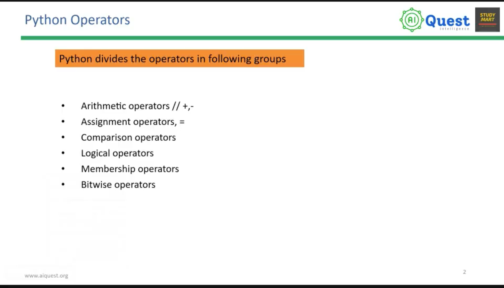
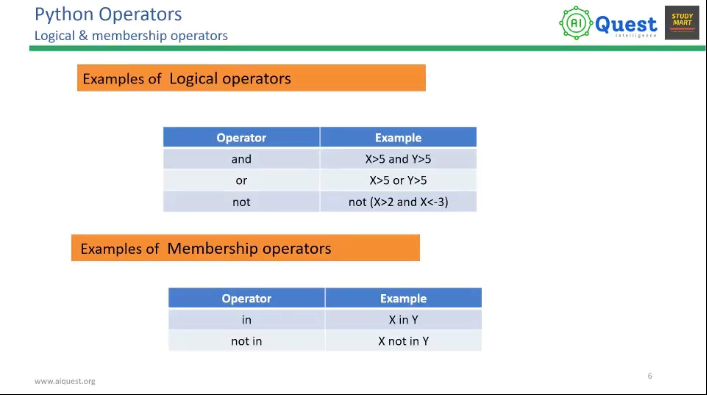
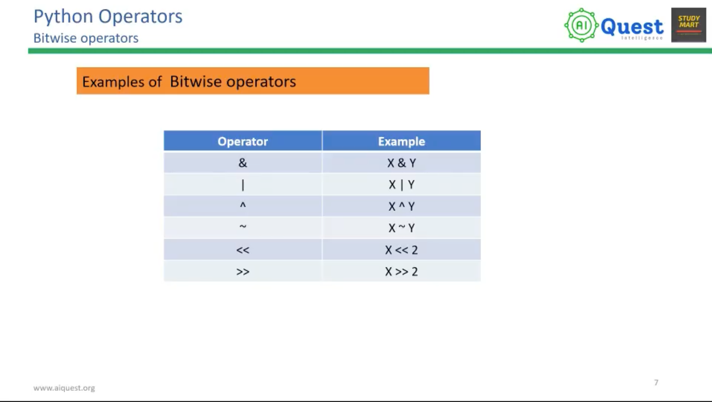
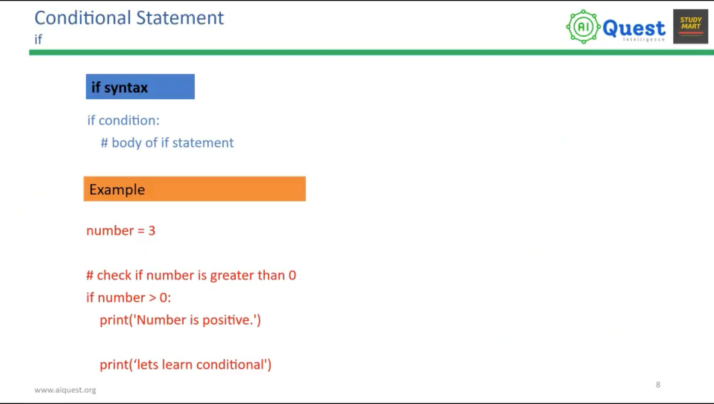
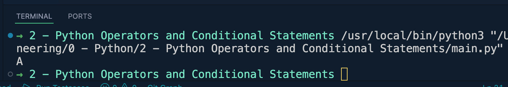

# 2 - Python Operators and Conditional Statements

## Python Operators






## Python Conditional Statement

```python 
marks = 75

if marks >= 80:
    print("A+")
elif marks >= 75:
    print("A")
else:
    print("F")
```
