# Python Loop
## range()
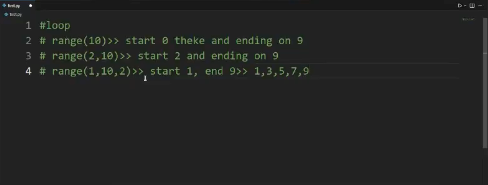
### Example 1:
```python  
for num in range(1):
    print(num)
```
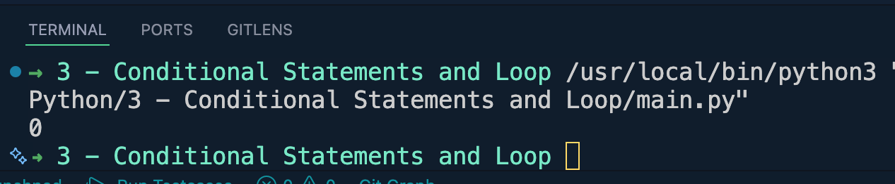
--------------------------------------------
### Example 2:
```python
for num in range(5):
    print(num)
```
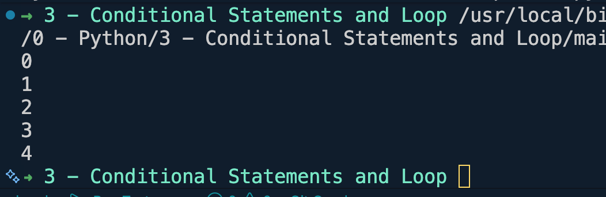
--------------------------------------------
### Example 3:
```python
for num in range(1, 12, 2):
    print(num)
```
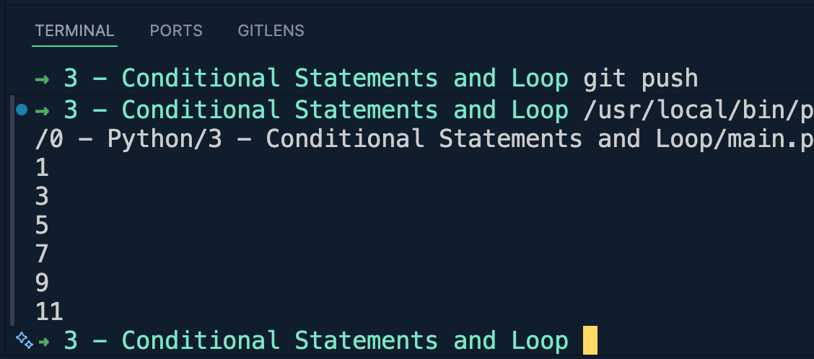
--------------------------------------------
### Example 4:
```python
for num in range(1, 12, 2):
    if num == 5:
        continue #skip for the value 5
    print(num)
```
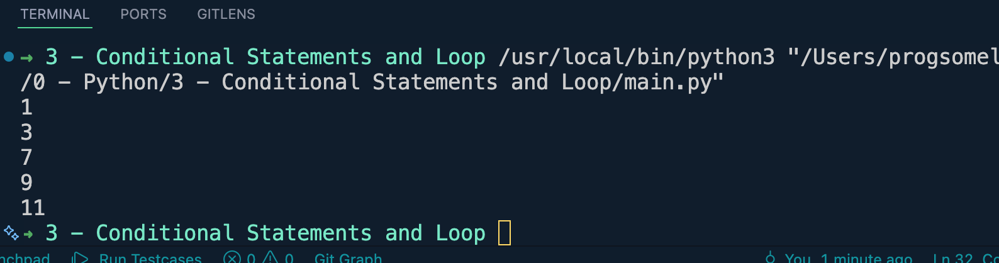
--------------------------------------------
### Example 5:
```python
for num in range(1, 12, 2):
    if num == 5:
        break #loop stop at value 5
    print(num)
```
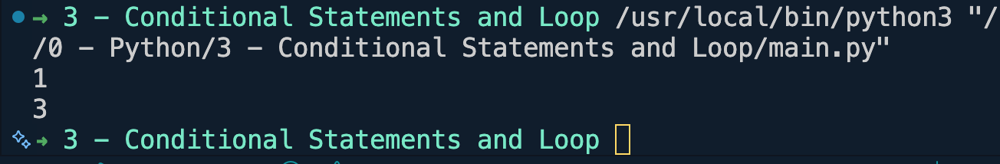
-------------------------------------------
### Example 6:
```python
#1+2+3+4+....+n
n = int(input("Enter a number: "))
total = 0
for num in range(1, n+1):
    total += num

print(total)
```
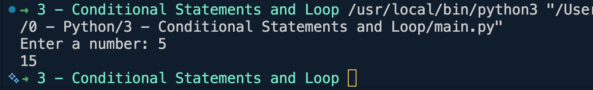
-------------------------------------------
### Example 7:
```python
#Multiplication Table
n = int(input("Enter a number: "))
for num in range(1, 11):
    print(f"{n} X {num} = {n*num}")
```
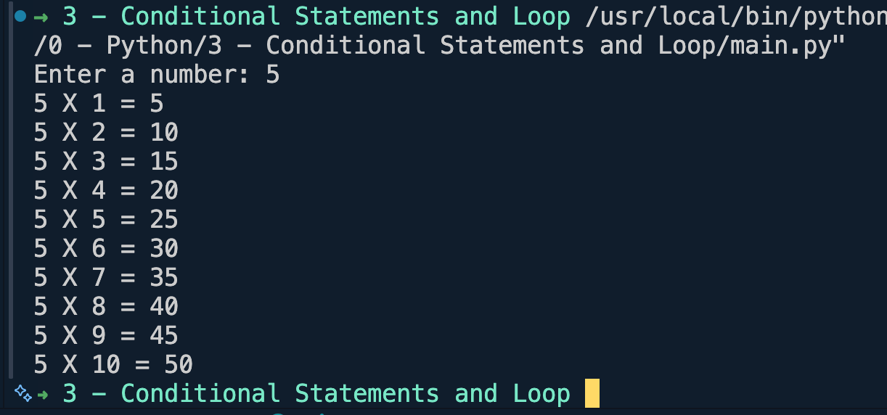


## while loop
### Example 1:
```python
num = 1
while num <= 11:
    print(num)
    num += 1
```
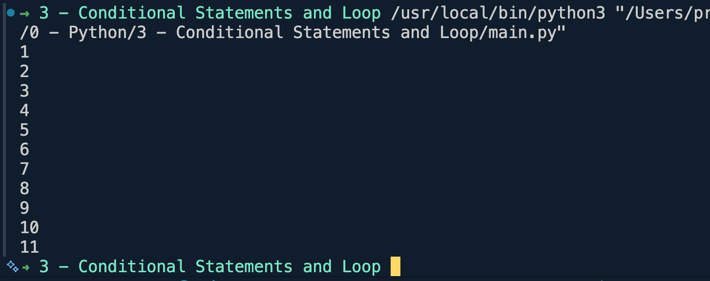
------------------------------------------
### Example 2:
```python
#1+2+3+4+....+n
n = int(input("Enter a number: "))
num = 1
total = 0
while num <= n:
    total+=num
    num+=1

print(total)
```
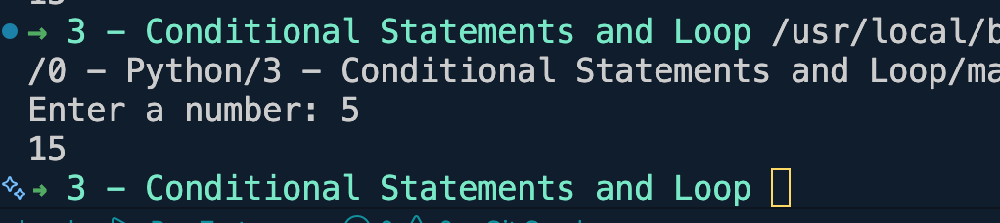
-----------------------------------------
### Example 3:
#### Factorial
```python
#1+2+3+4+....+n
n = int(input("Enter a number: "))
num = 1
total = 1
while num <= n:
    total*=num
    num+=1

print(total)
```
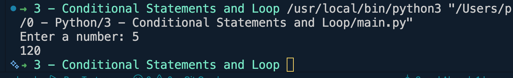
-------------------------------------------
### Example 4:
```python
# count digits
#6381
num = 6381
count = 0
while num > 0:
    num //= 10
    count+=1
print(count)
```
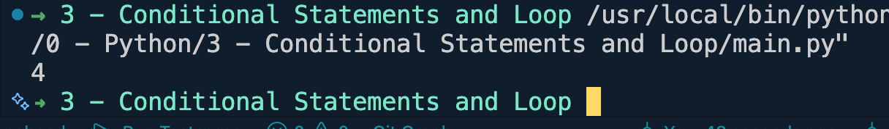
-------------------------------------------
### Example 5:
```python
# sum of digits
#6381
num = 6381
sum = 0
while num > 0:
    sum += (num %10)
    num //= 10
print(sum)
```
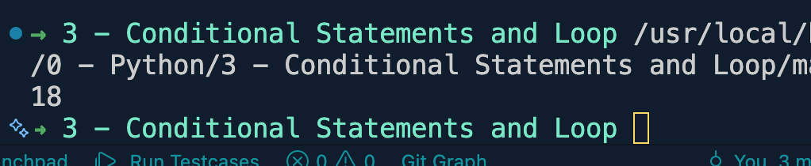


## break and continue
`break` stops the loop completely and jumps out of it.
`continue` skips the rest of the current iteration and moves to the next one.

### Example 1: break in a for loop
```python
for num in range(1, 10):
    if num == 5:
        break
    print(num)
# Output: 1 2 3 4
```
-------------------------------------------
### Example 2: continue in a for loop
```python
for num in range(1, 10):
    if num % 2 == 0:
        continue
    print(num)
# Output: 1 3 5 7 9
```
-------------------------------------------
### Example 3: break in a while loop
```python
num = 1
while True:
    if num > 5:
        break
    print(num)
    num += 1
# Output: 1 2 3 4 5
```
-------------------------------------------
### Example 4: continue in a while loop
```python
num = 0
while num < 10:
    num += 1
    if num % 2 == 0:
        continue
    print(num)
# Output: 1 3 5 7 9
```
-------------------------------------------
### Example 5: search a list and stop early (break)
```python
numbers = [4, 15, 22, 8, 34, 7, 19]
for n in numbers:
    if n % 7 == 0:
        print(f"Found: {n}")
        break
# Output: Found: 7
```


## switch statement (match-case)
Python has no `switch` keyword. From Python 3.10+, `match-case` is used instead.

### Example 1: basic match-case
```python
day = 3
match day:
    case 1:
        print("Monday")
    case 2:
        print("Tuesday")
    case 3:
        print("Wednesday")
    case _:
        print("Invalid day")
# Output: Wednesday
```
-------------------------------------------
### Example 2: multiple values in one case
```python
fruit = "mango"
match fruit:
    case "apple" | "mango" | "banana":
        print("Common fruit")
    case "dragonfruit" | "kiwano":
        print("Exotic fruit")
    case _:
        print("Unknown fruit")
# Output: Common fruit
```
-------------------------------------------
### Example 3: match-case with condition (guard)
```python
num = 15
match num:
    case n if n % 2 == 0:
        print(f"{n} is even")
    case n if n % 2 != 0:
        print(f"{n} is odd")
# Output: 15 is odd
```
-------------------------------------------
### Example 4: match-case on data structure
```python
point = (0, 5)
match point:
    case (0, 0):
        print("Origin")
    case (0, y):
        print(f"On the y-axis at {y}")
    case (x, 0):
        print(f"On the x-axis at {x}")
    case (x, y):
        print(f"Point at ({x}, {y})")
# Output: On the y-axis at 5
```