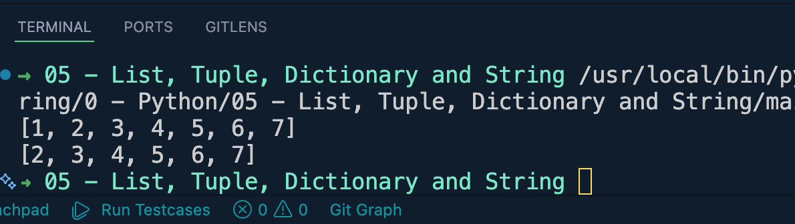
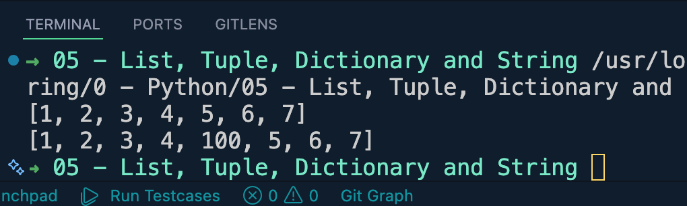
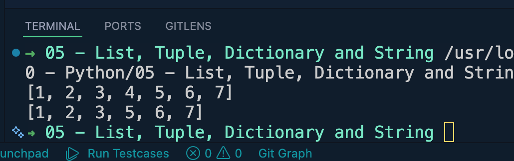
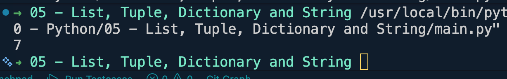
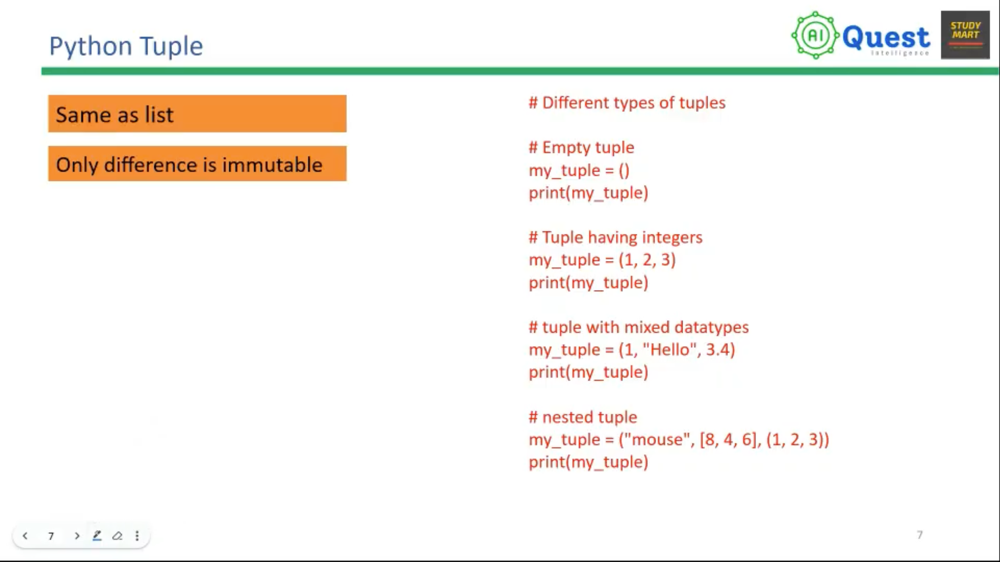
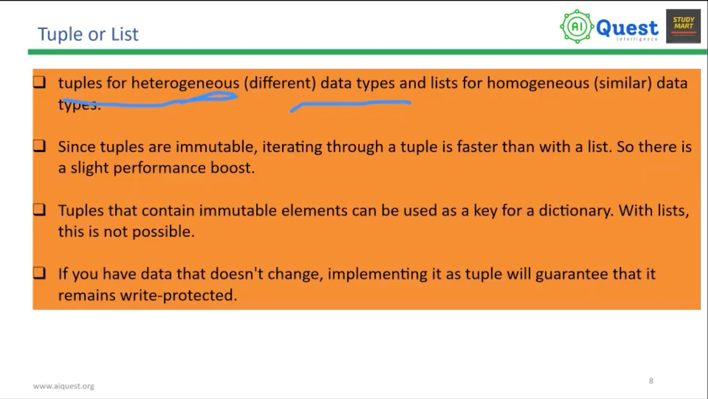
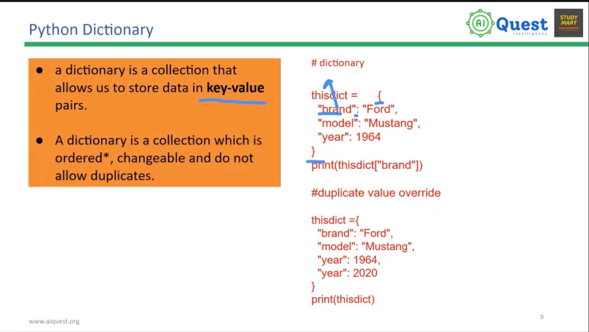

# List, Tuple, Dictionary and String

## Python List

### Example 1
```python
num = [1, 2, 3, 4, 5, 6, 7]
print(num)
print(num[4])
```

-----------------------------------
### Example 2
```python
num = [1, 2, 3, 4, 5, 6, 7]
print(num)
print(num[-4])
```

-----------------------------------
### Example 3
```python
#slicing
num = [1, 2, 3, 4, 5, 6, 7]
print(num[1:4])
```

----------------------------------
### Example 4
```python
#slicing
num = [1, 2, 3, 4, 5, 6, 7]
print(num)
print(num[1:])
```

----------------------------------
### Example 5
```python
#slicing
num = [1, 2, 3, 4, 5, 6, 7]
print(num)
print(num[:])
```

----------------------------------
### Example 6
```python
#slicing
num = [1, 2, 3, 4, 5, 6, 7]
print(num)
print(num[:4])
```

----------------------------------
### Example 7 -> appending at last-> .append(value)
```python
#adding element to list -> .appent()
num = [1, 2, 3, 4, 5, 6, 7]
print(num)
num.append(15)
print(num)
```

-----------------------------------
### Example 8 -> adding Element at specific position -> .insert(pos, val)
```python
#adding element to list
num = [1, 2, 3, 4, 5, 6, 7]
print(num)
num.insert(4, 100)
print(num)
```

----------------------------------
### Example 9 -> removing an element from the list -> .remove(valueToRemove)
```python
#deleting element from list
num = [1, 2, 3, 4, 5, 6, 7]
print(num)
num.remove(4)
print(num)
```

----------------------------------
### Example 10 -> deleting value using index number -> del array[index]
```python
#deleting element from list
num = [1, 2, 3, 4, 5, 6, 7]
print(num)
del num[5]
print(num)
```

----------------------------------
### Example 11 -> usage of membership operator in list
```python
num = [1, 2, 3, 4, 5, 6, 7]
print(5 in num)
print(100 in num)
```

----------------------------------
### Example 12 -> finding length of list
```python
num = [1, 2, 3, 4, 5, 6, 7]
print(len(num))
```

----------------------------------
### Example 13 -> list comprehensive
```python
list = [n**2 for n in range(1, 101)]
print(list)
```

---------------------------------

## Python Tuple -> it can not be changed after build


----------------------------------

## Python Dictionary

----------------------------------

## Python Strings
