# List, Tuple, Dictionary and String

## Python List
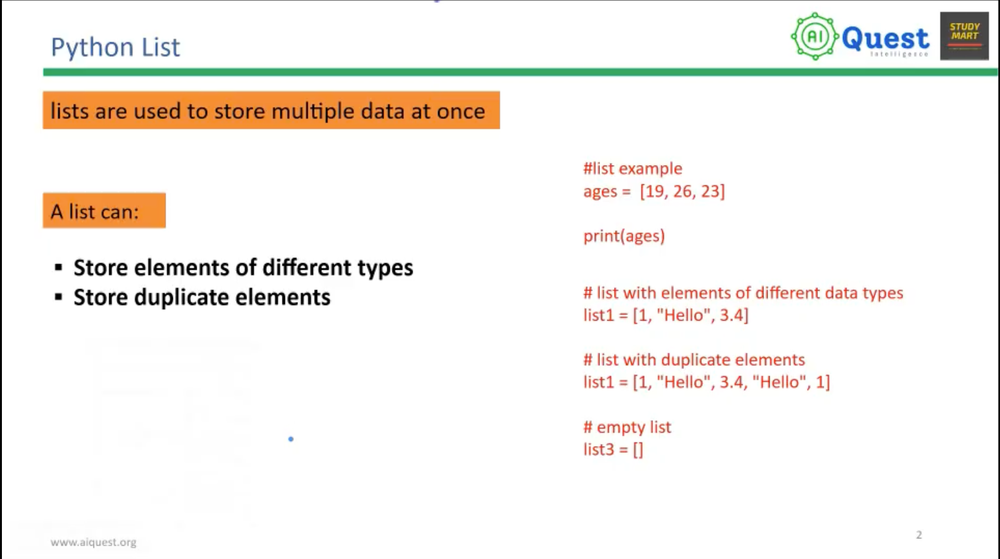
### Example 1
```python
num = [1, 2, 3, 4, 5, 6, 7]
print(num)
print(num[4])
```
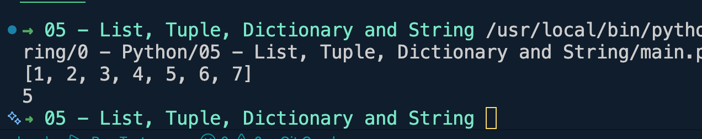
-----------------------------------
### Example 2
```python
num = [1, 2, 3, 4, 5, 6, 7]
print(num)
print(num[-4])
```
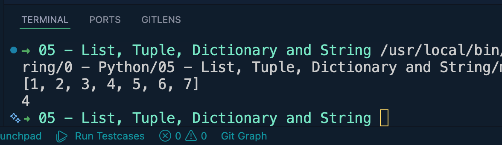
-----------------------------------
### Example 3
```python
#slicing
num = [1, 2, 3, 4, 5, 6, 7]
print(num[1:4])
```
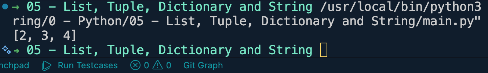
----------------------------------
### Example 4
```python
#slicing
num = [1, 2, 3, 4, 5, 6, 7]
print(num)
print(num[1:])
```
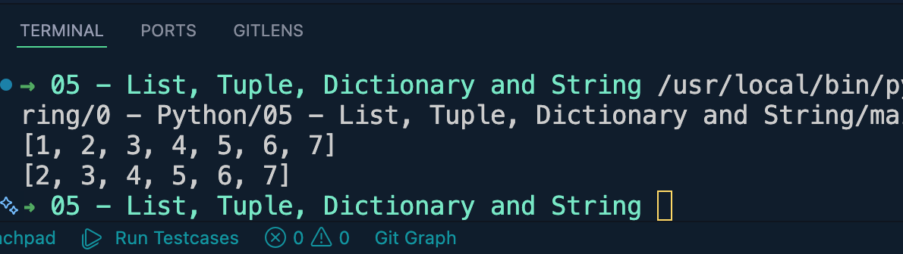
----------------------------------
### Example 5
```python
#slicing
num = [1, 2, 3, 4, 5, 6, 7]
print(num)
print(num[:])
```
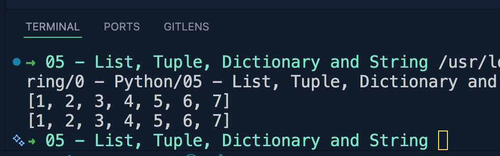
----------------------------------
### Example 6
```python
#slicing
num = [1, 2, 3, 4, 5, 6, 7]
print(num)
print(num[:4])
```
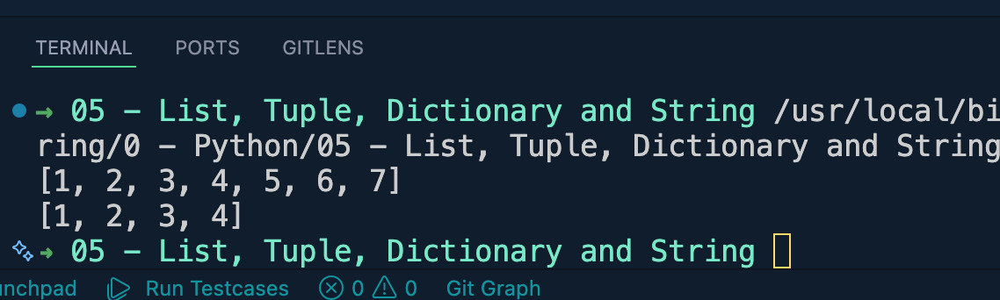
----------------------------------
### Example 7 -> appending at last-> .append(value)
```python
#adding element to list -> .appent()
num = [1, 2, 3, 4, 5, 6, 7]
print(num)
num.append(15)
print(num)
```
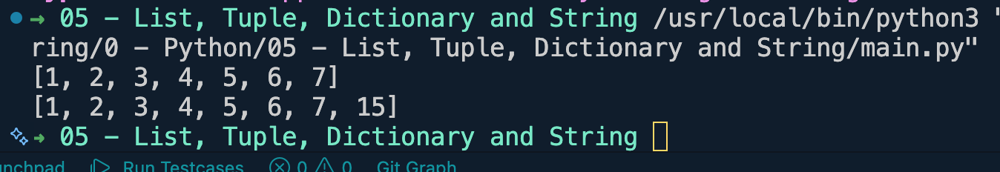
-----------------------------------
### Example 8 -> adding Element at specific position -> .insert(pos, val)
```python
#adding element to list
num = [1, 2, 3, 4, 5, 6, 7]
print(num)
num.insert(4, 100)
print(num)
```
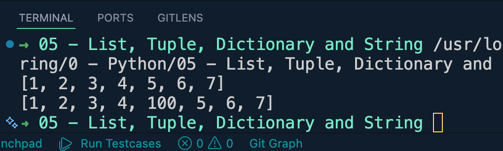
----------------------------------
### Example 9 -> removing an element from the list -> .remove(valueToRemove)
```python
#deleting element from list
num = [1, 2, 3, 4, 5, 6, 7]
print(num)
num.remove(4)
print(num)
```
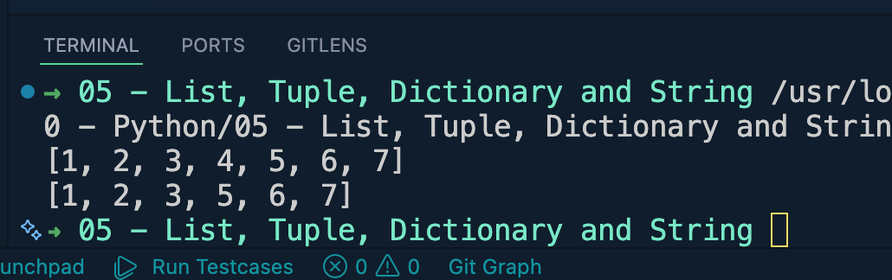
----------------------------------
### Example 10 -> deleting value using index number -> del array[index]
```python
#deleting element from list
num = [1, 2, 3, 4, 5, 6, 7]
print(num)
del num[5]
print(num)
```
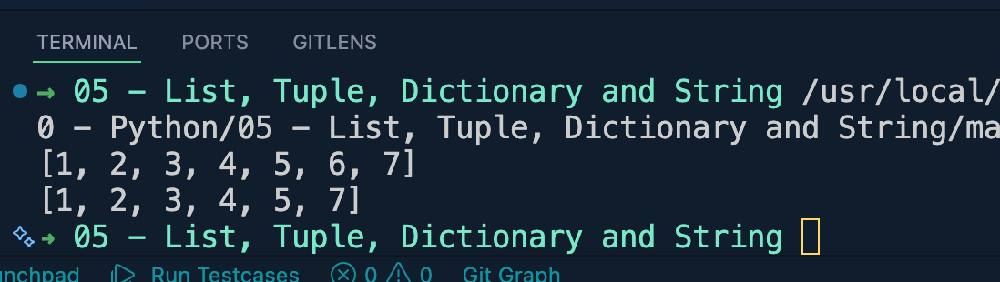
----------------------------------
### Example 11 -> usage of membership operator in list
```python
num = [1, 2, 3, 4, 5, 6, 7]
print(5 in num)
print(100 in num)
```
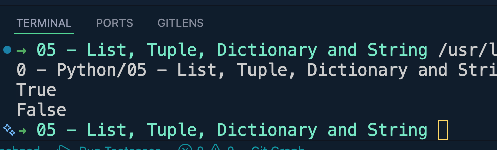
----------------------------------
### Example 12 -> finding length of list
```python
num = [1, 2, 3, 4, 5, 6, 7]
print(len(num))
```
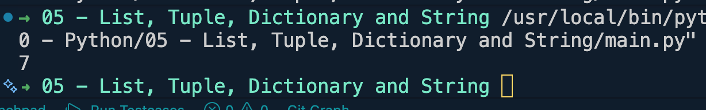
----------------------------------
### Example 13 -> list comprehensive
```python
list = [n**2 for n in range(1, 101)]
print(list)
```
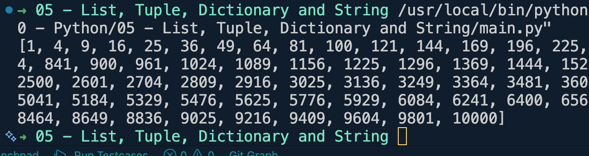
---------------------------------

## Python Tuple -> it can not be changed after build
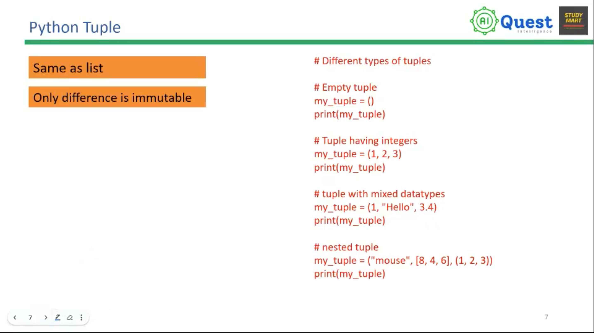
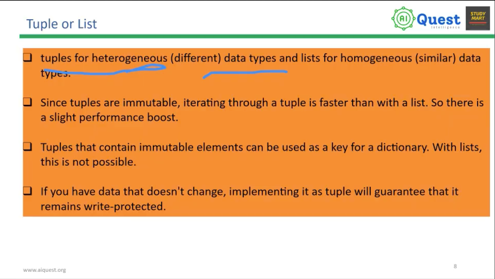
----------------------------------

## Python Dictionary
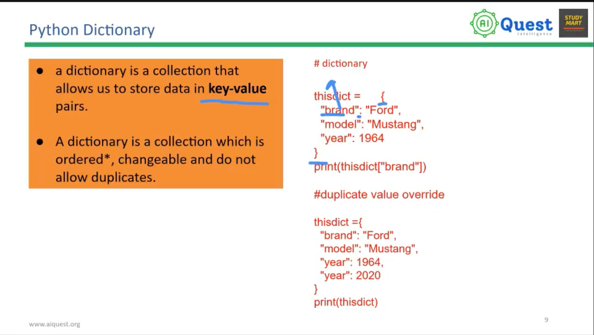
----------------------------------

## Python Strings
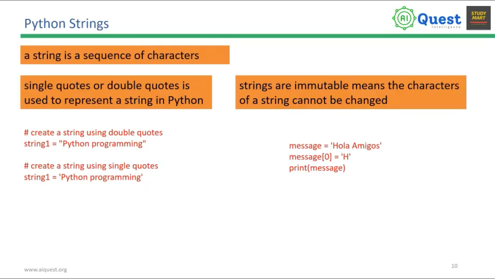
------------------------------------------------
### Example 1 -> string formatting using .format()
```python
name = "Somel"
age = 28

print("My name is {} and I am {} years old".format(name, age))
```
------------------------------------------------
### Example 2 -> string formatting using % operator
```python
name = "Somel"
age = 28

print("My name is %s and I am %d years old" % (name, age))
```
------------------------------------------------
### Example 3 -> multi-line strings using triple quotes
```python
message = """Hello,
Welcome to python Strings.
Let's Learn!
"""
print(message)
```
------------------------------------------------
### Example 4 -> raw strings -> r"..."
```python
path = r"C:\Users\Somel\Documents"
print(path)
```
------------------------------------------------
### Example 5 -> encoding a string to bytes -> .encode()
```python
text = "héllo"
encoded = text.encode("utf-8")
print(encoded)        # b'h\xc3\xa9llo'
print(type(encoded))  # <class 'bytes'>
```
------------------------------------------------
### Example 6 -> decoding bytes back to a string -> .decode()
```python
encoded = b'h\xc3\xa9llo'
decoded = encoded.decode("utf-8")
print(decoded)        # héllo
print(type(decoded))  # <class 'str'>
```
------------------------------------------------
### Example 7 -> encoding errors -> errors="ignore" / "replace"
```python
text = "café"
print(text.encode("ascii", errors="ignore"))    # b'caf'
print(text.encode("ascii", errors="replace"))   # b'caf?'
```
------------------------------------------------
### Example 8 -> byte string literals -> b"..."
```python
b = b"hello"
print(b)         # b'hello'
print(type(b))   # <class 'bytes'>
print(b[0])      # 104 (indexing a byte string returns an int)
```
------------------------------------------------
### Example 9 -> comparing encodings -> utf-8 vs utf-16
```python
text = "hello"
print(text.encode("utf-8"))    # b'hello'
print(text.encode("utf-16"))   # b'\xff\xfeh\x00e\x00l\x00l\x00o\x00'
```
------------------------------------------------

## Python Strings - Interview Questions

**Q1. Are strings mutable or immutable in Python?**
Strings are immutable. Any operation that appears to modify a string (e.g. concatenation, `.replace()`, `.upper()`) actually creates and returns a new string object; the original is unchanged.
```python
s = "hello"
s2 = s.upper()
print(s)   # hello
print(s2)  # HELLO
```

**Q2. How do you reverse a string?**
```python
s = "hello"
print(s[::-1])   # olleh
```

**Q3. How do you check if a string is a palindrome?**
```python
def is_palindrome(s):
    return s == s[::-1]

print(is_palindrome("madam"))  # True
```

**Q4. Difference between `.format()`, `%` formatting, and f-strings?**
All three produce formatted output, but f-strings (Python 3.6+) are evaluated at runtime and are generally the fastest and most readable.
```python
name = "Somel"
print(f"My name is {name}")
```

**Q5. What is the difference between `str.strip()`, `.lstrip()`, and `.rstrip()`?**
`.strip()` removes leading and trailing whitespace (or given characters); `.lstrip()` only from the left; `.rstrip()` only from the right.

**Q6. How do you check if a string contains only digits/alphabets?**
`.isdigit()`, `.isalpha()`, `.isalnum()` check the content of the string.
```python
print("123".isdigit())   # True
print("abc".isalpha())   # True
print("abc123".isalnum())# True
```

**Q7. How do you count occurrences of a character/substring in a string?**
```python
s = "banana"
print(s.count("a"))   # 3
```

**Q8. How do you check if two strings are anagrams?**
```python
def is_anagram(a, b):
    return sorted(a) == sorted(b)

print(is_anagram("listen", "silent"))  # True
```

**Q9. What's the difference between `split()` and `join()`?**
`split()` breaks a string into a list based on a delimiter; `join()` does the opposite, combining a list of strings into one using a separator.
```python
words = "a,b,c".split(",")   # ['a', 'b', 'c']
print("-".join(words))       # a-b-c
```

**Q10. What does a raw string (`r"..."`) do, and why is it useful?**
A raw string tells Python to treat backslashes as literal characters instead of escape sequences. It's commonly used for file paths and regular expressions.
```python
path = r"C:\Users\Somel\Documents"
```

**Q11. How do you find the first non-repeating character in a string?**
```python
def first_unique(s):
    for ch in s:
        if s.count(ch) == 1:
            return ch
    return None

print(first_unique("swiss"))  # w
```

**Q12. What is string interning in Python?**
Python may reuse (intern) small, simple string objects to save memory, so two identical short string literals can point to the same object in memory (checked via `is`). This is a CPython optimization detail, not guaranteed behavior.
```python
a = "hello"
b = "hello"
print(a is b)  # True (usually, due to interning)
```

**Q13. How do you check if a string starts/ends with a given substring?**
```python
s = "hello world"
print(s.startswith("hello"))  # True
print(s.endswith("world"))    # True
```

**Q14. What is the time complexity of string concatenation in a loop, and why should you avoid it?**
Since strings are immutable, `s += char` in a loop creates a new string each time (O(n) per iteration), giving O(n²) overall. Prefer `"".join(list_of_strings)`, which is O(n).

------------------------------------------------


## Python set
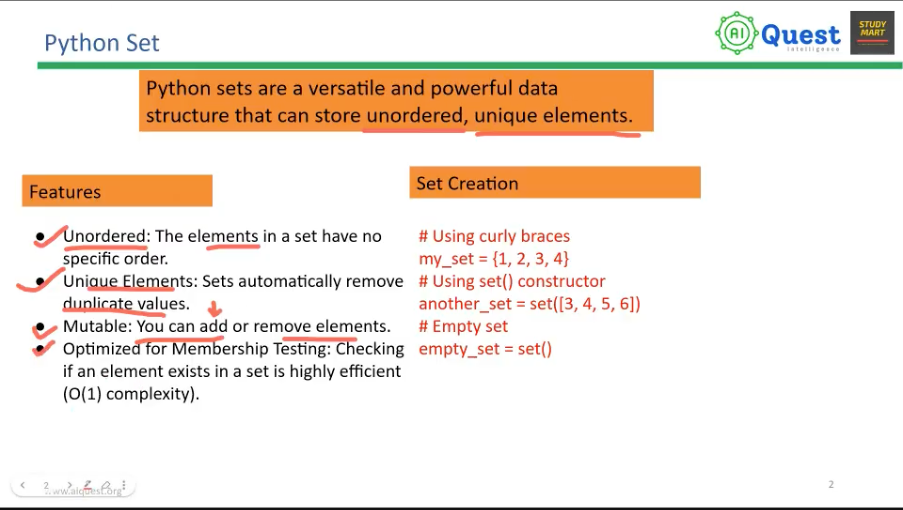
------------------------------------------------
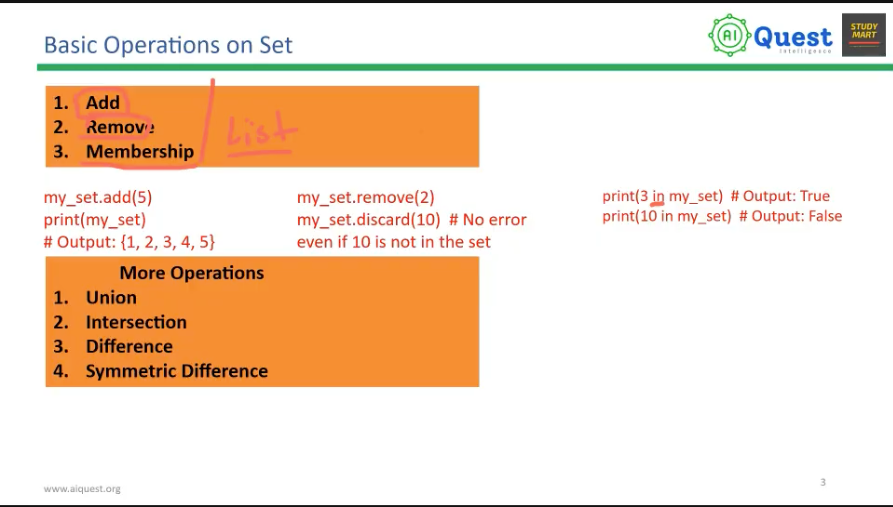
------------------------------------------------
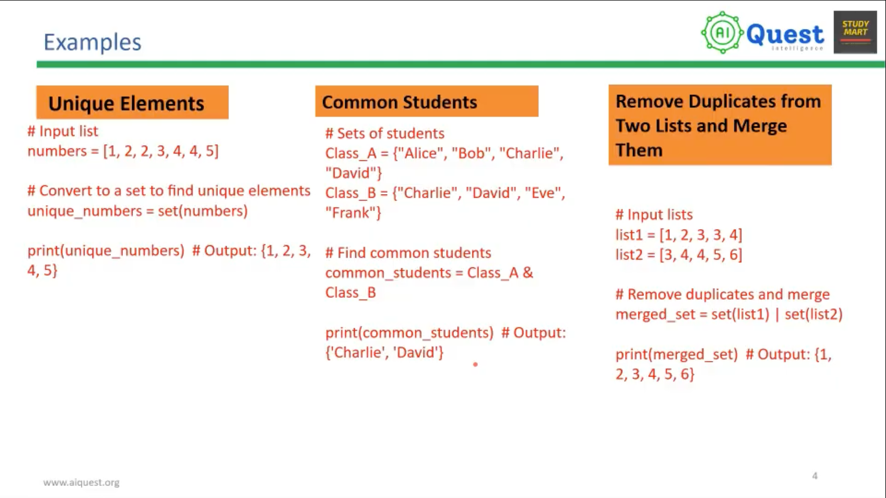