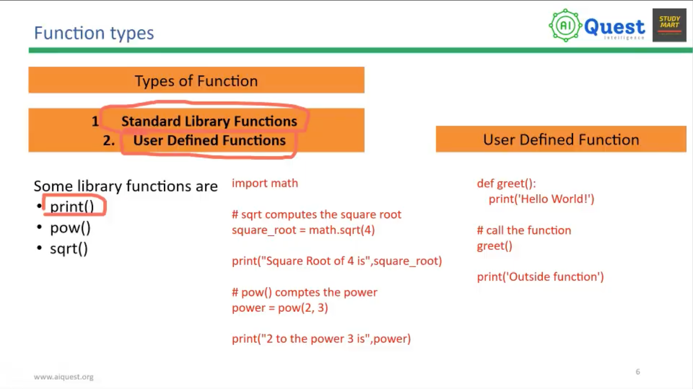

# Function, Variable Scope

## Python Function

-------------------------------------


## Examples

### Function syntax
```python
def function_name(parameters):
    # statement
    return expression
```

### Standard Library Functions
```python
import math

# sqrt computes the square root
square_root = math.sqrt(4)
print("Square Root of 4 is", square_root)

# pow() computes the power
power = pow(2, 3)
print("2 to the power 3 is", power)
```

### User Defined Functions
```python
def greet():
    print('Hello World!')

# call the function
greet()

print('Outside function')
```

### Function with parameters and return value
```python
def add(a, b):
    result = a + b
    return result

total = add(5, 3)
print("Sum is", total)
```

### Variable Scope
```python
x = 10  # global variable

def show_scope():
    x = 5  # local variable, only visible inside the function
    print("Inside function:", x)

show_scope()
print("Outside function:", x)
```

```python
count = 0  # global variable

def increment():
    global count  # refer to the global variable, not a new local one
    count += 1

increment()
increment()
print("count is", count)  # count is 2
```