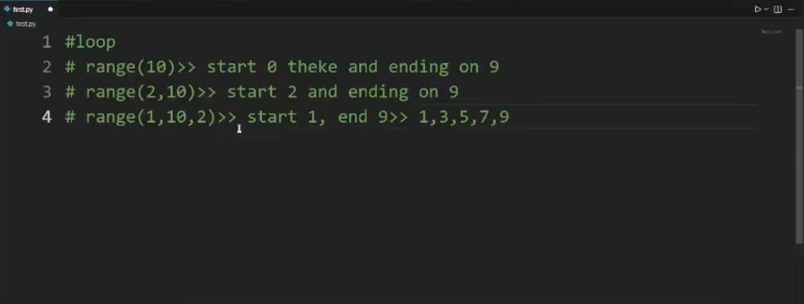
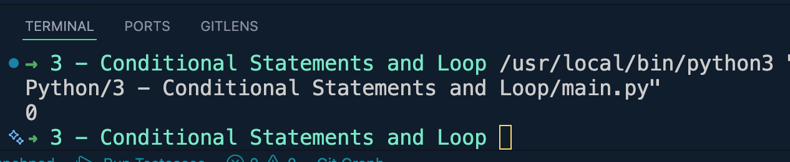
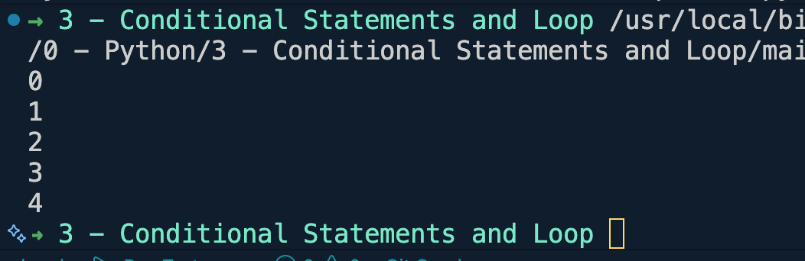
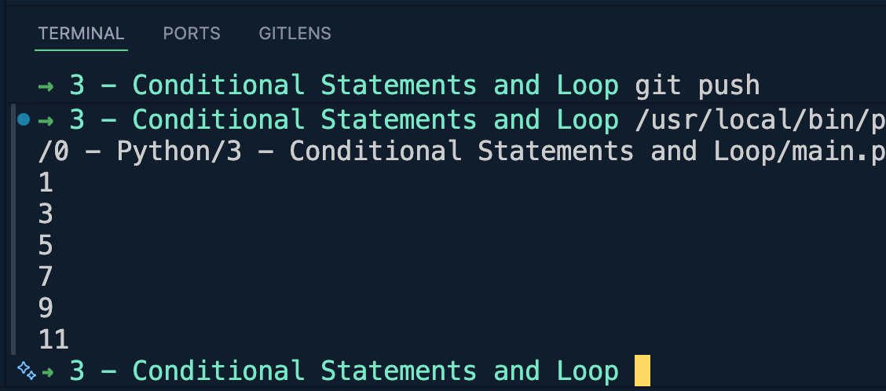
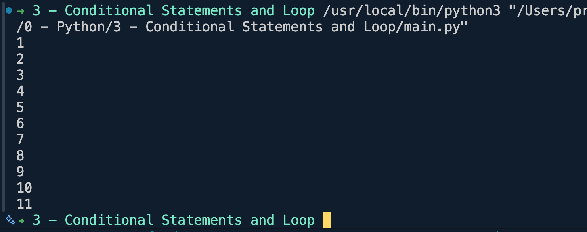

# Python Loop
## range()

### Example 1:
```python  
for num in range(1):
    print(num)
```

--------------------------------------------
### Example 2:
```python
for num in range(5):
    print(num)
```

--------------------------------------------
### Example 3:
```python
for num in range(1, 12, 2):
    print(num)
```


## while loop
### Example 1:
```python
num = 1
while num <= 11:
    print(num)
    num += 1
```

