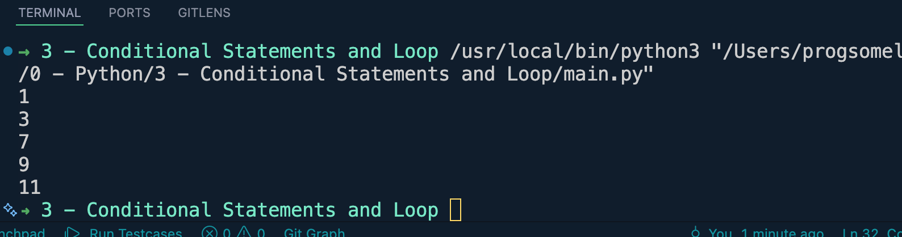
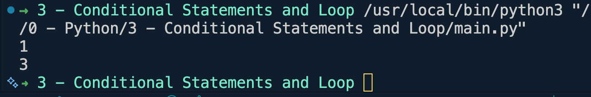
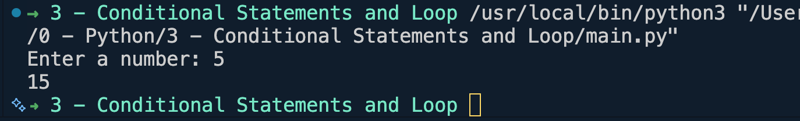
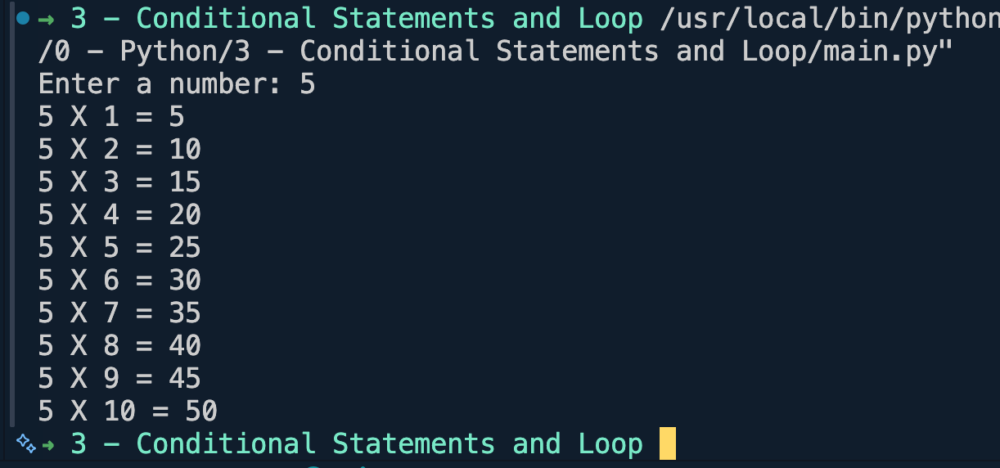
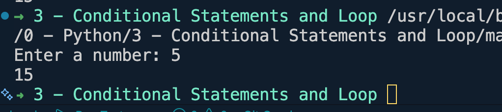
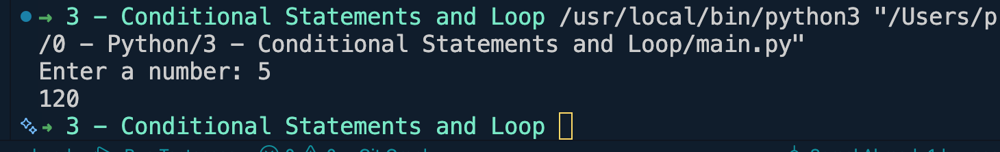

# Python Loop
## range()

### Example 1:
```python  
for num in range(1):
    print(num)
```

--------------------------------------------
### Example 2:
```python
for num in range(5):
    print(num)
```

--------------------------------------------
### Example 3:
```python
for num in range(1, 12, 2):
    print(num)
```

--------------------------------------------
### Example 4:
```python
for num in range(1, 12, 2):
    if num == 5:
        continue #skip for the value 5
    print(num)
```

--------------------------------------------
### Example 5:
```python
for num in range(1, 12, 2):
    if num == 5:
        break #loop stop at value 5
    print(num)
```

-------------------------------------------
### Example 6:
```python
#1+2+3+4+....+n
n = int(input("Enter a number: "))
total = 0
for num in range(1, n+1):
    total += num

print(total)
```

-------------------------------------------
### Example 7:
```python
#Multiplication Table
n = int(input("Enter a number: "))
for num in range(1, 11):
    print(f"{n} X {num} = {n*num}")
```



## while loop
### Example 1:
```python
num = 1
while num <= 11:
    print(num)
    num += 1
```

------------------------------------------
### Example 2:
```python
#1+2+3+4+....+n
n = int(input("Enter a number: "))
num = 1
total = 0
while num <= n:
    total+=num
    num+=1

print(total)
```

-----------------------------------------
### Example 3:
#### Factorial
```python
#1+2+3+4+....+n
n = int(input("Enter a number: "))
num = 1
total = 1
while num <= n:
    total*=num
    num+=1

print(total)
```
