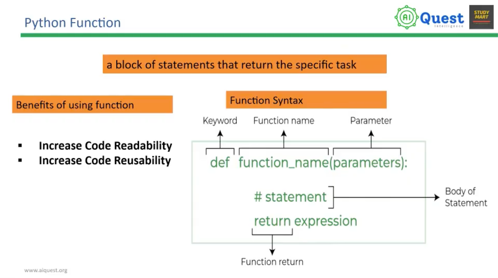

# Function, Variable Scope

## Python Function

-------------------------------------


## Examples

### Function syntax
```python
def function_name(parameters):
    # statement
    return expression
```

### Standard Library Functions
```python
import math

# sqrt computes the square root
square_root = math.sqrt(4)
print("Square Root of 4 is", square_root)

# pow() computes the power
power = pow(2, 3)
print("2 to the power 3 is", power)
```

### User Defined Functions
```python
def greet():
    print('Hello World!')

# call the function
greet()

print('Outside function')
```

### Function with parameters and return value
```python
def add(a, b):
    result = a + b
    return result

total = add(5, 3)
print("Sum is", total)
```

### Variable Scope
```python
x = 10  # global variable

def show_scope():
    x = 5  # local variable, only visible inside the function
    print("Inside function:", x)

show_scope()
print("Outside function:", x)
```

```python
count = 0  # global variable

def increment():
    global count  # refer to the global variable, not a new local one
    count += 1

increment()
increment()
print("count is", count)  # count is 2
```

### Enclosing (Nonlocal) Scope - nested functions
```python
def outer():
    message = "Hi"  # enclosing variable

    def inner():
        print("Inner sees:", message)  # can read the enclosing variable

    inner()

outer()
```

```python
def outer():
    message = "Hi"

    def inner():
        nonlocal message  # refer to the enclosing variable, not a new local one
        message = "Hello"

    inner()
    print("After inner:", message)  # After inner: Hello

outer()
```

### LEGB Rule (Local -> Enclosing -> Global -> Built-in)
```python
x = "global"

def outer():
    x = "enclosing"

    def inner():
        x = "local"
        print(x)  # local - found in Local scope first

    inner()
    print(x)  # enclosing

outer()
print(x)  # global
```

### Default Arguments
```python
def greet_person(name, greeting="Hello"):
    print(f"{greeting}, {name}!")

greet_person("Somel")             # uses default greeting -> Hello, Somel!
greet_person("Somel", "Welcome")  # overrides default -> Welcome, Somel!
```

### *args (variable number of positional arguments) store as tuple
```python
def add_all(*args):
    total = 0
    for num in args:
        total += num
    return total

print("Sum:", add_all(1, 2, 3, 4))  # Sum: 10
```

### **kwargs (variable number of keyword arguments) stores as dictionary
```python
def print_info(**kwargs):
    for key, value in kwargs.items():
        print(f"{key}: {value}")

print_info(name="Somel", age=25, country="Bangladesh")
```

### Combining normal, default, *args and **kwargs
```python
def full_example(a, b=10, *args, **kwargs):
    print("a:", a)
    print("b:", b)
    print("args:", args)
    print("kwargs:", kwargs)

full_example(1, 2, 3, 4, x=5, y=6)
# a: 1
# b: 2
# args: (3, 4)
# kwargs: {'x': 5, 'y': 6}
```

### Lambda Expression
```python
# a small anonymous function: lambda parameters: expression
square = lambda x: x * x
print("Square of 5:", square(5))  # Square of 5: 25

add = lambda a, b: a + b
print("Sum with lambda:", add(3, 4))  # Sum with lambda: 7
```

### Lambda with built-in functions
```python
students = [("Somel", 25), ("Rafi", 22), ("Alif", 28)]

# key=lambda tells sorted() what to sort by
sorted_by_age = sorted(students, key=lambda student: student[1])
print("Sorted by age:", sorted_by_age)
```

### returning multiple values from function
```python
def calculate(a, b):
    return a+b, a-b, a*b
add, sub, mul = calculate(10, 5)
print(add, sub, mul)
```