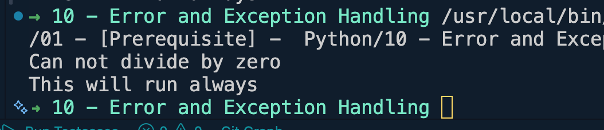
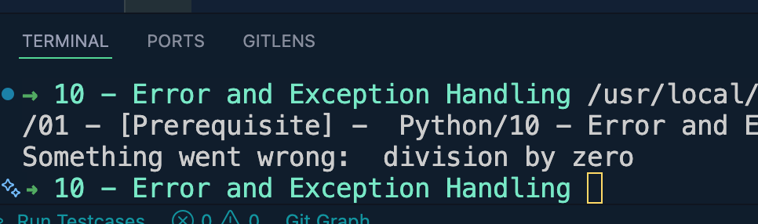
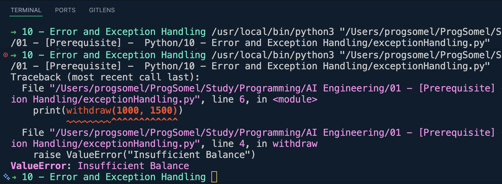
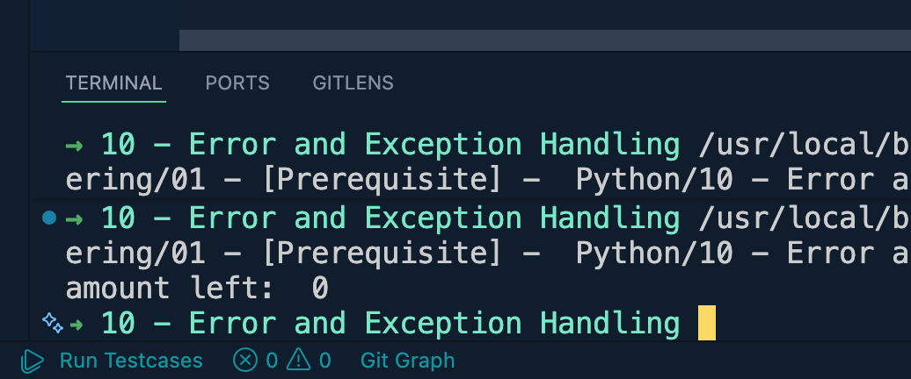
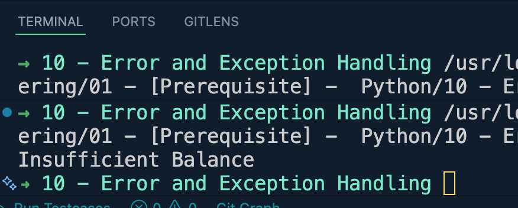
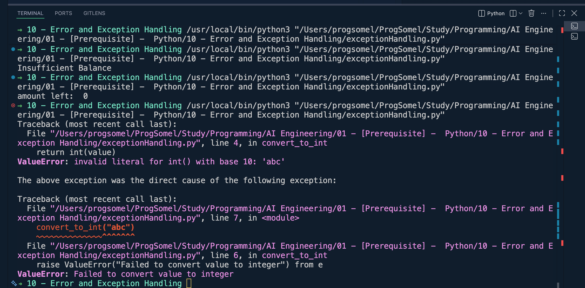
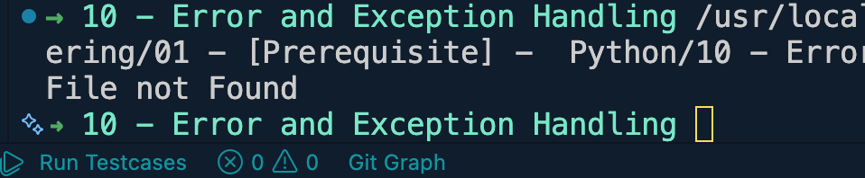

# Error and Exception Handling
# Exceptions are errors that occur while the program is running.
# If they are not handled, the program stops execution

## Built-in Exceptions — Examples

### 1. SyntaxError
Raised when Python can't parse your code (invalid syntax). Happens at compile time, before the program even runs.
```python
if True
    print("missing colon")
# SyntaxError: expected ':'
```

### 2. IndentationError
A subclass of SyntaxError, raised when indentation is inconsistent or missing.
```python
def greet():
print("hello")
# IndentationError: expected an indented block after function definition on line 1
```

### 3. NameError
Raised when a variable or function name is not found in the current scope.
```python
print(age)
# NameError: name 'age' is not defined
```

### 4. TypeError
Raised when an operation or function is applied to an object of an inappropriate type.
```python
result = "5" + 5
# TypeError: can only concatenate str (not "int") to str
```

### 5. ValueError
Raised when a function receives an argument of the right type but an inappropriate value.
```python
number = int("abc")
# ValueError: invalid literal for int() with base 10: 'abc'
```

### 6. IndexError
Raised when trying to access an index that is out of range for a sequence (list, tuple, string).
```python
fruits = ["apple", "banana"]
print(fruits[5])
# IndexError: list index out of range
```

### 7. KeyError
Raised when a dictionary key is not found.
```python
person = {"name": "Ali"}
print(person["age"])
# KeyError: 'age'
```

### 8. AttributeError
Raised when an attribute or method doesn't exist on an object.
```python
number = 10
number.append(5)
# AttributeError: 'int' object has no attribute 'append'
```

### 9. ZeroDivisionError
Raised when dividing (or modulo) by zero.
```python
result = 10 / 0
# ZeroDivisionError: division by zero
```

### 10. FileNotFoundError
Raised when trying to open a file that doesn't exist.
```python
with open("missing_file.txt") as f:
    content = f.read()
# FileNotFoundError: [Errno 2] No such file or directory: 'missing_file.txt'
```

### 11. ImportError / ModuleNotFoundError
Raised when an import statement fails to find the module or name.
```python
import non_existing_module
# ModuleNotFoundError: No module named 'non_existing_module'

from math import non_existing_function
# ImportError: cannot import name 'non_existing_function' from 'math'
```

### 12. StopIteration
Raised by an iterator's `__next__()` when there are no more items.
```python
numbers = iter([1, 2])
next(numbers)
next(numbers)
next(numbers)
# StopIteration
```

### 13. OverflowError
Raised when a numeric calculation exceeds the maximum limit (rare in Python since ints are arbitrary precision, but happens with floats).
```python
import math
print(math.exp(1000))
# OverflowError: math range error
```

### 14. RecursionError
Raised when the maximum recursion depth is exceeded (subclass of RuntimeError).
```python
def recurse():
    return recurse()

recurse()
# RecursionError: maximum recursion depth exceeded
```

### 15. MemoryError
Raised when an operation runs out of memory.
```python
huge_list = [1] * (10 ** 20)
# MemoryError
```

### 16. PermissionError
Raised when trying to perform an operation without adequate access rights (e.g., writing to a read-only file/folder).
```python
with open("/etc/protected_file", "w") as f:
    f.write("data")
# PermissionError: [Errno 13] Permission denied: '/etc/protected_file'
```

### 17. UnicodeDecodeError
Raised when decoding bytes into a string fails due to encoding mismatch.
```python
b"\xff".decode("utf-8")
# UnicodeDecodeError: 'utf-8' codec can't decode byte 0xff in position 0
```

### 18. AssertionError
Raised when an `assert` statement fails.
```python
age = -5
assert age >= 0, "Age cannot be negative"
# AssertionError: Age cannot be negative
```

### 19. NotImplementedError
Raised deliberately (usually in abstract methods) to indicate a subclass must implement the method.
```python
class Shape:
    def area(self):
        raise NotImplementedError("Subclasses must implement area()")

Shape().area()
# NotImplementedError: Subclasses must implement area()
```

### 20. RuntimeError
A generic error raised when no other specific exception fits.
```python
raise RuntimeError("Something went wrong during execution")
# RuntimeError: Something went wrong during execution
```

### 21. OSError
Raised for system-related errors (file/network/OS operations). FileNotFoundError, PermissionError, TimeoutError, etc. are all subclasses of OSError.
```python
import os
os.rmdir("non_existing_folder")
# FileNotFoundError: [Errno 2] No such file or directory: 'non_existing_folder'
```

### 22. TimeoutError
Raised when a system function times out.
```python
import socket
socket.setdefaulttimeout(1)
socket.create_connection(("10.255.255.1", 80))
# TimeoutError: timed out
```

### 23. ArithmeticError
Base class for numeric errors like ZeroDivisionError, OverflowError, FloatingPointError.
```python
try:
    result = 10 / 0
except ArithmeticError as e:
    print("Arithmetic problem:", e)
```

### 24. LookupError
Base class for IndexError and KeyError — useful when you want to catch either.
```python
try:
    data = {"a": 1}
    print(data["b"])
except LookupError as e:
    print("Lookup failed:", e)
```

---

## Handling Exceptions

### try / except
```python
try:
    result = 10 / 0
except ZeroDivisionError:
    print("Cannot divide by zero!")
```

### Catching multiple exceptions
```python
try:
    value = int("abc")
except (ValueError, TypeError) as e:
    print("Error occurred:", e)
```

### try / except / else / finally
```python
try:
    number = int("10")
except ValueError:
    print("Invalid number!")
else:
    print("Conversion succeeded:", number)   # runs if no exception occurred
finally:
    print("This always runs.")               # cleanup code, runs no matter what
```
```python
try:
    result = 10 / 0
except ValueError:
    print("Invalid Input")
except ZeroDivisionError:
    print("Can not divide by zero")
else:
    print("Conversion successful: ", result)
finally:
    print("This will run always")
```


### Raising your own exceptions
```python
def set_age(age):
    if age < 0:
        raise ValueError("Age cannot be negative")
    return age

set_age(-1)
# ValueError: Age cannot be negative
```

## Broad Exception -> catches almost every error
```python
try:
    result = 10 / 0
except Exception:
    print("Something went wrong")
```

```python
try:
    result = 10 / 0
except Exception as e:
    print("Something went wrong: ", e)
```


## Manually raising an exception
```python
def withdraw(balance, amount):
    if amount > balance:
        raise ValueError("Insufficient Balance")
    return balance - amount
print(withdraw(1000, 1500))
```


### Custom exception classes
```python
class InsufficientFundsError(Exception):
    """Raised when a withdrawal exceeds the available balance."""
    pass

def withdraw(balance, amount):
    if amount > balance:
        raise InsufficientFundsError("Not enough funds for this withdrawal")
    return balance - amount

withdraw(100, 500)
# InsufficientFundsError: Not enough funds for this withdrawal
```

```python
class InsufficientFundsError(Exception):
    pass

def withdraw(balance, amount):
    if amount > balance:
        raise InsufficientFundsError("Insufficient Balance")
    return balance - amount

try:
    left = withdraw(1000, 1000)
except InsufficientFundsError as e:
    print(e)
else:
    print("amount left: ", left)   
```


```python
class InsufficientFundsError(Exception):
    pass

def withdraw(balance, amount):
    if amount > balance:
        raise InsufficientFundsError("Insufficient Balance")
    return balance - amount

try:
    left = withdraw(1000, 1500)
except InsufficientFundsError as e:
    print(e)
else:
    print("amount left: ", left)
```


## Exception chaining is used when one exception happens because of another exception
```python
def convert_to_int(value):
    try:
        return int(value)
    except ValueError as e:
        raise ValueError("Failed to convert value to integer") from e
convert_to_int("abc")
```


## finally -> cleanup
```python
file = None

try:
    file = open("output.txt", "r")
    content = file.read()
except FileNotFoundError:
    print("File not Found")
finally:
    if file:
        file.close()
```
