# File & I/O
File I/O (Input/Output) lets a program read data from files and write data to files, so information can persist after the program ends.

```python 
file = open("notes.txt", "r")
content = file.read() #Read One line
file.readlines()
file.close()

print(content)

file = open("notes.txt", "a")
file.write("\nHello Python\n")
file.close()
```
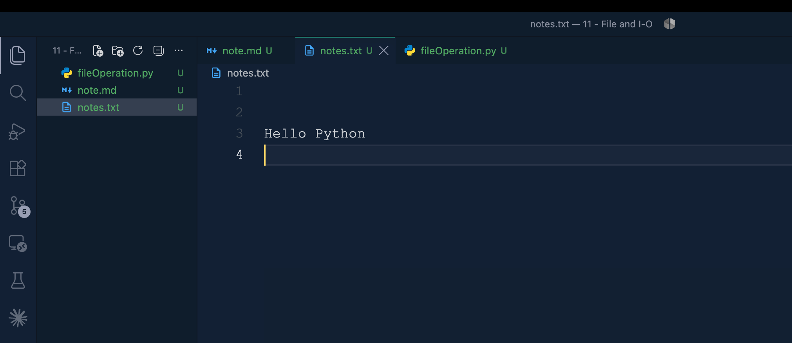

## `open()` and file modes
`open(path, mode, encoding=...)` returns a file object. The mode controls how the file is opened.

| Mode | Meaning |
|------|---------|
| `"r"` | Read (default). Fails with `FileNotFoundError` if the file doesn't exist. |
| `"w"` | Write. Creates the file if missing, **overwrites/truncates** if it exists. |
| `"a"` | Append. Creates the file if missing, writes are added to the end. |
| `"x"` | Exclusive create. Fails with `FileExistsError` if the file already exists. |
| `"r+"` | Read and write, file must already exist. |
| `"w+"` | Write and read, truncates the file first. |
| `"a+"` | Append and read. |
| `"b"` | Binary mode, combine with the above, e.g. `"rb"`, `"wb"`. |
| `"t"` | Text mode (default), combine with the above, e.g. `"rt"`. |

Always close a file after opening it manually — otherwise data may not be flushed to disk and the file handle stays locked/open. This is why `with` (below) is preferred.

## with statement automatically closes after the file use
`with` opens the file, runs the block, and guarantees `file.close()` is called even if an exception happens inside the block.
```python
with open("notes.txt", "r", encoding="utf-8") as file:
    content = file.read()
print(content)
```
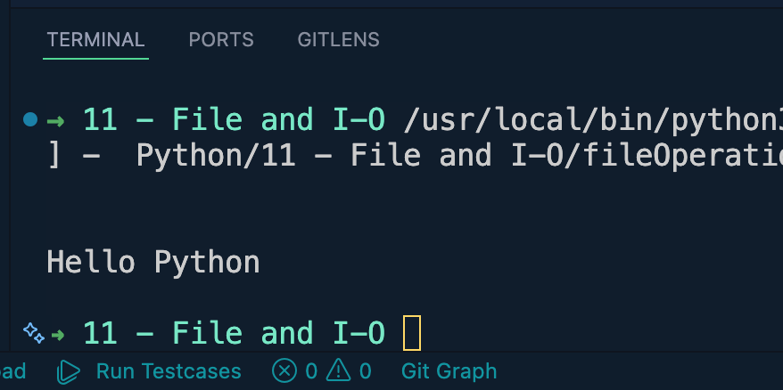

```python
with open("notes.txt", "w", encoding="utf-8") as file:
    file.write("\nHello Somel")
```
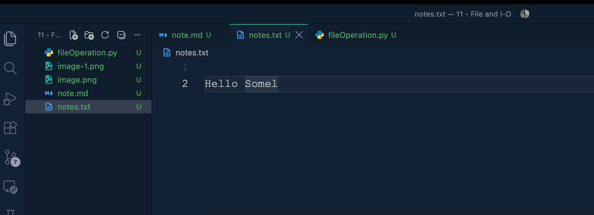

## Reading a file: read() vs readline() vs readlines() vs iterating
```python
with open("notes.txt", "r", encoding="utf-8") as file:
    whole_text = file.read()          # entire file as one string

with open("notes.txt", "r", encoding="utf-8") as file:
    first_line = file.readline()      # reads a single line (including the "\n")
    second_line = file.readline()

with open("notes.txt", "r", encoding="utf-8") as file:
    lines = file.readlines()          # list of every line, e.g. ["line1\n", "line2\n"]

with open("notes.txt", "r", encoding="utf-8") as file:
    for line in file:                 # most memory-efficient way for big files,
        print(line.strip())           # reads one line at a time instead of loading it all
```

## Writing to a file: write() vs writelines()
```python
with open("notes.txt", "w", encoding="utf-8") as file:
    file.write("first line\n")
    file.write("second line\n")

lines = ["one\n", "two\n", "three\n"]
with open("notes.txt", "w", encoding="utf-8") as file:
    file.writelines(lines)            # writes a list of strings, does NOT add "\n" automatically
```

## Appending vs overwriting
`"w"` truncates the file (erases old content) every time it's opened, `"a"` keeps existing content and adds new content at the end.
```python
with open("notes.txt", "w", encoding="utf-8") as file:
    file.write("This replaces everything in the file.\n")

with open("notes.txt", "a", encoding="utf-8") as file:
    file.write("This is added at the end, old content stays.\n")
```

## Binary files (images, PDFs, executables, etc.)
Use `"b"` modes and don't pass `encoding=` — data is read/written as raw `bytes`, not `str`.
```python
with open("image.png", "rb") as source:
    data = source.read()

with open("image_copy.png", "wb") as destination:
    destination.write(data)
```

## seek() and tell() -> move around inside a file
`tell()` returns the current cursor position (in bytes), `seek(offset)` moves the cursor there.
```python
with open("notes.txt", "r", encoding="utf-8") as file:
    print(file.tell())        # 0, cursor at the start
    file.read(5)               # read first 5 characters
    print(file.tell())        # 5, cursor moved forward
    file.seek(0)                # jump back to the beginning
    print(file.read())        # reads the whole file again
```

## os.path -> helps us work with file and folder paths

```python
# os.path -> helps us work with file and folder paths
import os

path = "notes.txt"

print(os.path.exists(path))
print(os.path.abspath(path))

file_path = os.path.join("data", "notes.txt")
print(file_path)
```
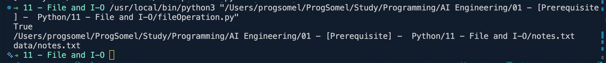

### More os / os.path examples
```python
import os

# Inspecting paths
print(os.path.isfile("notes.txt"))          # True if it's a file
print(os.path.isdir("data"))                # True if it's a folder
print(os.path.getsize("notes.txt"))         # size in bytes
print(os.path.split("data/notes.txt"))      # ('data', 'notes.txt')
print(os.path.splitext("notes.txt"))        # ('notes', '.txt')
print(os.path.dirname("data/notes.txt"))    # 'data'
print(os.path.basename("data/notes.txt"))   # 'notes.txt'

# Creating / listing / removing
os.makedirs("data", exist_ok=True)          # creates folder(s), no error if it already exists
print(os.listdir("."))                      # list everything in the current folder
os.rename("notes.txt", "renamed_notes.txt")
os.remove("renamed_notes.txt")              # deletes a file
os.rmdir("data")                            # deletes an EMPTY folder
```

## pathlib -> modern and cleaner way to work with file paths in python.
```python
#it treats path like objects, so the code becomes easier to understand

from pathlib import Path

path = Path("notes.txt")

print(path.exists())
print(path.absolute())
```
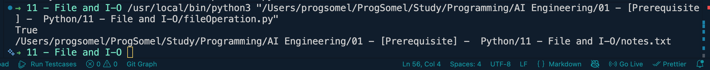

```python
from pathlib import Path

path = Path("notes.txt")

print(path.exists())
print(path.absolute())

content = path.read_text(encoding="utf-8")
print(content)
```
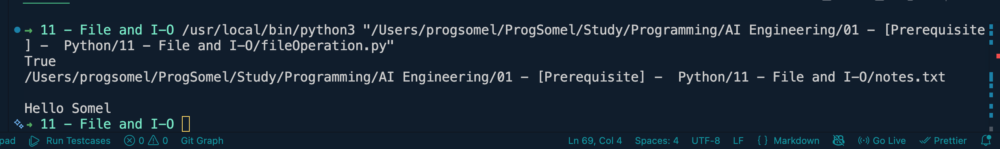

### More pathlib examples
```python
from pathlib import Path

path = Path("data/notes.txt")

print(path.name)          # 'notes.txt'
print(path.stem)          # 'notes'
print(path.suffix)        # '.txt'
print(path.parent)        # 'data'

# Reading / writing without manually opening/closing
path.parent.mkdir(exist_ok=True)          # create the 'data' folder if missing
path.write_text("Hello from pathlib\n", encoding="utf-8")
print(path.read_text(encoding="utf-8"))

# Listing / searching files
for item in Path(".").iterdir():          # everything directly inside the folder
    print(item)

for txt_file in Path(".").glob("*.txt"):  # pattern matching, e.g. all .txt files
    print(txt_file)

path.unlink()                              # deletes the file (like os.remove)
```

## Working with CSV files (the csv module)
```python
import csv

# Writing rows
with open("people.csv", "w", newline="", encoding="utf-8") as file:
    writer = csv.writer(file)
    writer.writerow(["name", "age"])          # header
    writer.writerow(["Ali", 25])
    writer.writerow(["Somel", 30])

# Reading rows
with open("people.csv", "r", encoding="utf-8") as file:
    reader = csv.reader(file)
    for row in reader:
        print(row)                             # each row is a list, e.g. ['Ali', '25']

# Reading/writing as dictionaries (uses the header row as keys)
with open("people.csv", "r", encoding="utf-8") as file:
    reader = csv.DictReader(file)
    for row in reader:
        print(row["name"], row["age"])

with open("people.csv", "a", newline="", encoding="utf-8") as file:
    writer = csv.DictWriter(file, fieldnames=["name", "age"])
    writer.writerow({"name": "Sara", "age": 22})
```

## Working with JSON files (the json module)
```python
import json

data = {"name": "Somel", "age": 25, "skills": ["Python", "AI"]}

# Writing a Python object to a JSON file
with open("data.json", "w", encoding="utf-8") as file:
    json.dump(data, file, indent=4)

# Reading a JSON file back into a Python object
with open("data.json", "r", encoding="utf-8") as file:
    loaded = json.load(file)
print(loaded["name"])

# Converting to/from JSON strings (no file involved)
json_string = json.dumps(data, indent=4)
parsed = json.loads(json_string)
```

## Handling file errors safely
Reading/writing files can fail (missing file, no permission, disk full), so wrap file operations in `try/except` — see [[10 - Error and Exception Handling]] notes for exception details.
```python
try:
    with open("missing_file.txt", "r", encoding="utf-8") as file:
        content = file.read()
except FileNotFoundError:
    print("File not found!")
except PermissionError:
    print("No permission to read this file!")
else:
    print(content)
finally:
    print("Done attempting to read the file.")
```

## Copying / moving files (shutil)
`shutil` builds on top of `os` for higher-level file operations.
```python
import shutil

shutil.copy("notes.txt", "notes_backup.txt")     # copy a file
shutil.move("notes_backup.txt", "data/notes_backup.txt")  # move/rename a file
shutil.rmtree("data")                              # delete a folder AND everything inside it
```

## Standard Streams -> python has three standard streams that handle input, output and errors
## stdin -> standard input
## stdout -> standard output
## stderr -> standard error
## std -> standard input
```python
name = input("Enter your name: ")
print(name)

import sys

data = sys.stdin.readlines()
print(data)
```
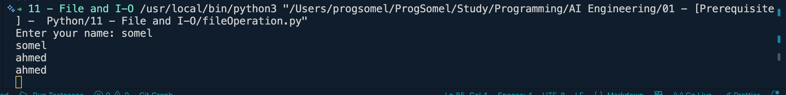

## stdout
```python
print("This is normal output")

import sys
sys.stdout.write("Hello Students")
```
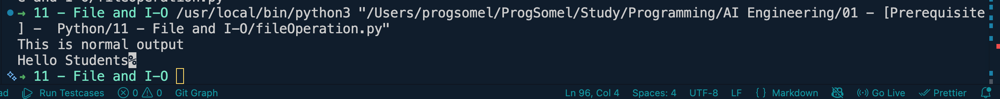

## stderr
`sys.stdout` has no `.error()` method — the correct way to write to the error stream is `sys.stderr.write(...)`, or `print(..., file=sys.stderr)`.
```python
import sys
sys.stderr.write("This is an error message\n")

# equivalent using print
print("This is an error message", file=sys.stderr)
```
`stdout` and `stderr` are separate streams so error messages can be filtered/redirected independently of normal output, e.g. in the terminal: `python script.py 2> errors.log` sends only stderr to a file while stdout still prints normally.

## Serialization -> means converting python data into a format that can be saved in a file or transferred over a network
```python
#json -> readable text format
#csv -> tabular data format
#pickle -> python specific binary format

import json

student = {
    "name": "Riya",
    "age": 25
}

with open("student.json", "w", encoding="utf-8") as file:
    json.dump(student, file)
```
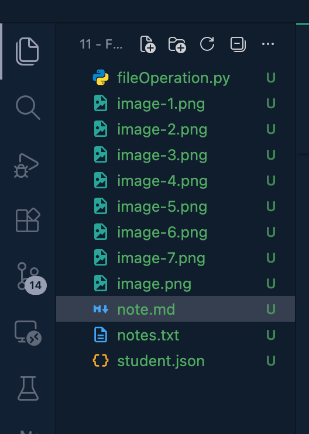
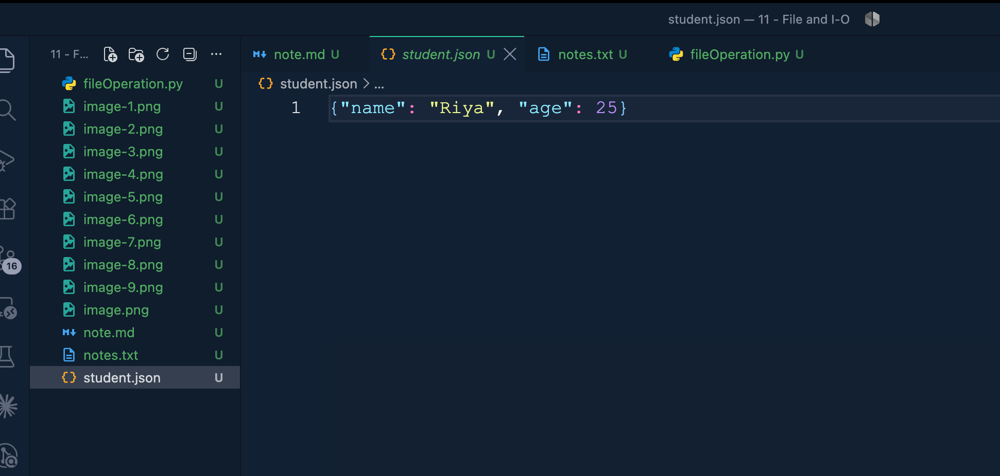

```python
import json

student = {
    "name": "Riya",
    "age": 25
}

with open("student.json", "w", encoding="utf-8") as file:
    json.dump(student, file)

with open("student.json", "r", encoding="utf-8") as file:
    data = json.load(file)
print(data)
```
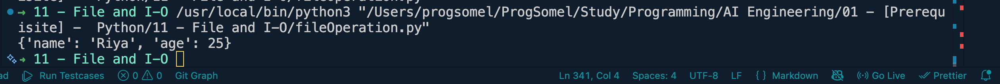

```python
import csv

students = [
    ["name", "age"],
    ["Somel", 25],
    ["Riya", 25]
]

with open("students.csv", "w", encoding="utf-8") as file:
    writer = csv.writer(file)
    writer.writerows(students)
```
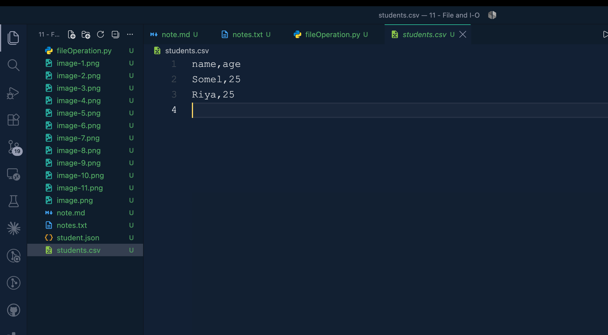

```python
import csv

with open("students.csv", "r", encoding="utf-8") as file:
    reader = csv.reader(file)
    for row in reader:
        print(row)
```
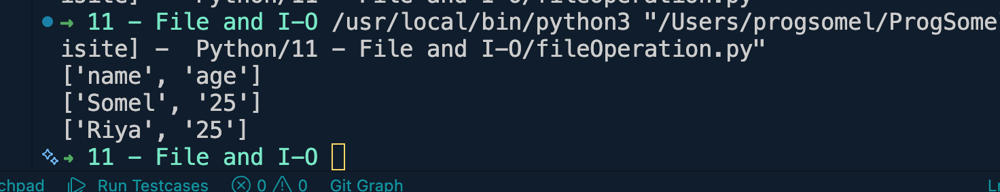

## Pickle
Pickle is Python's own binary serialization format — unlike JSON/CSV it can serialize almost **any** Python object (custom classes, sets, tuples, functions, datetime objects, etc.), not just basic types. The trade-off: the output is binary (not human-readable) and only Python can read it back.
```python
import pickle

student = {
    "name": "Somel",
    "age": 25
}

with open("student.pkl", "wb") as file:
    pickle.dump(student, file)
```
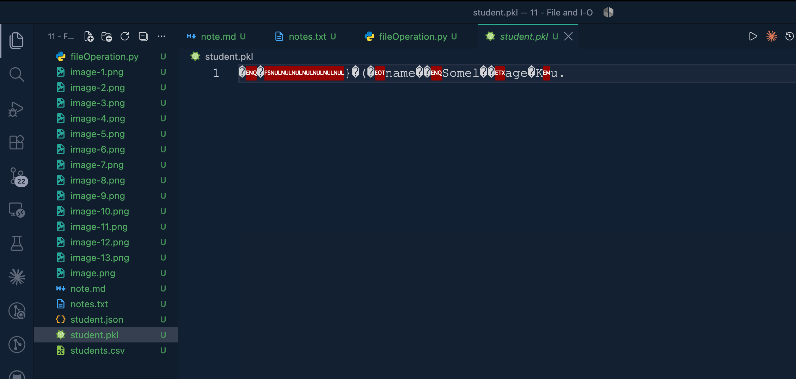

```python
## Pickle
import pickle

with open("student.pkl", "rb") as file:
    data = pickle.load(file)
print(data)
```


### JSON vs CSV vs Pickle — when to use which

| | JSON | CSV | Pickle |
|---|---|---|---|
| Format | Text (human-readable) | Text (tabular) | Binary |
| Data types | dict, list, str, int, float, bool, None | Flat rows/columns only | Almost any Python object |
| Cross-language | Yes, universal | Yes, universal | No, Python-only |
| Typical use | APIs, config files, web data | Spreadsheets, tabular datasets | Caching Python objects, ML models |
| Security | Safe to load from anywhere | Safe to load from anywhere | **Never load from an untrusted source** |

### Pickling a custom class instance
```python
import pickle

class Student:
    def __init__(self, name, age):
        self.name = name
        self.age = age

    def __repr__(self):
        return f"Student(name={self.name!r}, age={self.age})"

somel = Student("Somel", 25)

with open("student_obj.pkl", "wb") as file:
    pickle.dump(somel, file)             # saves the whole object, not just a dict

with open("student_obj.pkl", "rb") as file:
    restored = pickle.load(file)
print(restored)                           # Student(name='Somel', age=25)
```

### Serializing/deserializing without a file (dumps / loads)
Both `json` and `pickle` can convert to/from an in-memory string or bytes object, useful when sending data over a network instead of saving it to disk.
```python
import json, pickle

student = {"name": "Somel", "age": 25}

json_bytes = json.dumps(student).encode("utf-8")   # str -> bytes, ready to send over a socket
pickle_bytes = pickle.dumps(student)                 # already bytes

print(json.loads(json_bytes.decode("utf-8")))
print(pickle.loads(pickle_bytes))
```

### JSON formatting options
```python
import json

student = {"name": "Somel", "age": 25, "skills": ["Python", "AI"]}

print(json.dumps(student))                                   # compact, one line
print(json.dumps(student, indent=4))                          # pretty-printed
print(json.dumps(student, sort_keys=True))                    # alphabetically ordered keys
print(json.dumps({"city": "Dhaka"}, ensure_ascii=False))      # keep non-ASCII characters as-is
```

### Serializing objects JSON doesn't support natively (default / object_hook)
JSON has no concept of a `datetime`, `set`, or custom class — use `default=` to tell `json.dump` how to convert them, and `object_hook=` to convert them back on load.
```python
import json
from datetime import datetime

data = {"name": "Somel", "joined": datetime.now()}

def convert(obj):
    if isinstance(obj, datetime):
        return obj.isoformat()          # turn it into a JSON-friendly string
    raise TypeError(f"Object of type {type(obj)} is not JSON serializable")

with open("event.json", "w", encoding="utf-8") as file:
    json.dump(data, file, default=convert, indent=4)

with open("event.json", "r", encoding="utf-8") as file:
    loaded = json.load(file)            # "joined" comes back as a plain string, not a datetime
print(loaded)
```

### ⚠️ Pickle security warning
`pickle.load()` can execute arbitrary code while unpickling. **Never unpickle data from an untrusted or unauthenticated source** (e.g. a file uploaded by a user, data from an unencrypted network connection). For data exchange with the outside world, prefer JSON or CSV instead.

### shelve -> a persistent, dictionary-like store built on pickle
Useful for quickly saving/loading Python objects by key without setting up a full database.
```python
import shelve

with shelve.open("student_shelf") as db:
    db["somel"] = {"name": "Somel", "age": 25}   # write, like a dict

with shelve.open("student_shelf") as db:
    print(db["somel"])                             # read it back later
```